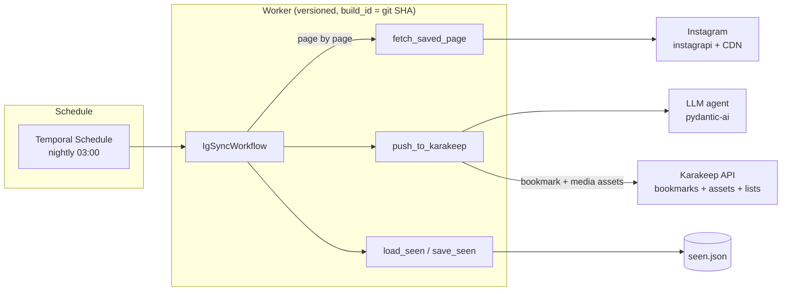

# Instagram → Karakeep, orchestrated with Temporal

[](https://github.com/abriemme/temporal-tests/actions/workflows/ci.yml)
[](.python-version)
[](https://docs.temporal.io/develop/python/worker-versioning)
[](https://ai.pydantic.dev)

A production-grade rewrite of a real automation: every night, the posts saved
on an Instagram account are turned into enriched bookmarks in
[Karakeep](https://karakeep.app/). It was previously a Python script driven by
n8n over HTTP; it is now a **Temporal application** — durable, replayable, and
testable — with **LLM-powered enrichment** (title, summary, tags, and routing
into the right Karakeep lists) via [pydantic-ai](https://ai.pydantic.dev).

Each saved post becomes a bookmark with:

- a **hybrid tag set** — deterministic metadata tags (hashtags, author, media
  type, music, location) merged with the LLM's tags;
- **uploaded media** — the post's thumbnail (banner + screenshot, replacing
  Karakeep's login-wall crawl), every carousel slide, optionally the Reel video
  and the author's avatar, all pulled from the Instagram CDN at import time
  (the signed URLs expire) and uploaded to Karakeep as assets;
- **list routing** from both the Instagram collections the post belongs to and
  the LLM's classification;
- the publication date as `createdAt`, so the Karakeep timeline reflects the
  content, not the sync.

A **reconcile** mode (`--reconcile`) confronts each post with the real state of
Karakeep instead of `seen.json`, completing older bookmarks whose thumbnails
were never uploaded. Backfills page through the whole history with a cursor
that lives in the **workflow state** — an interrupted run resumes on its own,
no `cursor.json` on disk.

## Why Temporal (what the n8n version had to hand-roll)

| Hand-rolled in the n8n script | Temporal primitive |
|---|---|
| HTTP endpoint + n8n cron trigger | Schedule (`python -m app.starter schedule`) |
| `cooldown.json` circuit-breaker on Instagram challenges | `workflow.sleep(cooldown)` timer, survives restarts |
| Threads + lock to prevent concurrent syncs | one workflow execution at a time, observable in the UI |
| Manual retry booleans | per-activity `RetryPolicy` + timeouts |
| `time.sleep` pacing, lost on crash | `workflow.sleep` timers (deterministic, replayable) |
| "did it work?" status endpoint | workflow result + history in the Temporal UI |

## Architecture



- **Workflow** (`app/sync/workflow.py`) — pure, deterministic orchestration:
  page-by-page cursor pagination (cursor held in workflow state), dedup against
  the seen-state, oldest-first ordering, pacing timers between pushes and
  pages, circuit-breaker cooldown when Instagram raises a challenge, and a
  reconcile branch that reprocesses every fetched post.
- **Activities** (`app/sync/activities.py`) — thin Temporal wrappers; all I/O
  lives in a service layer (`instagram.py`, `karakeep.py`, `state.py`),
  unit-testable without any worker.
- **Enrichment** (`app/sync/enrich.py`) — a pydantic-ai agent (GPT-5-mini)
  turns each caption into a structured `EnrichedBookmark`: a clean title, a
  summary, tags, and the Karakeep list(s) the post belongs to — chosen from the
  account's actual lists (fetched once and cached), copied verbatim, and left
  empty when nothing clearly fits.
- **Deterministic facts** (`app/sync/facts.py`) — LLM-free note and tag
  derivation from metadata (hashtags with a spam guard, author, media type,
  music, location). The push activity merges these tags with the LLM's and uses
  the rich note as the bookmark's searchable text.
- **Assets & collections** (`app/sync/karakeep.py`) — CDN download + Karakeep
  upload (banner, screenshot, carousel, video, avatar; per-file size cap), plus
  Instagram-collection → Karakeep-list routing. Transient errors are absorbed
  by the push activity's retry policy.

## Engineering practices

- **Worker Deployment Versioning**: the worker registers with `build_id` = git
  SHA; each execution stays pinned to its version (`VersioningBehavior.PINNED`).
- **Tests (43)**: time-skipping workflow tests (`WorkflowEnvironment`), service
  unit tests (facts, assets, reconcile, maintenance), `ActivityEnvironment`
  tests, and a **replay test** that re-runs a committed JSON history to catch
  determinism-breaking changes before deploy.
- **Observability**: optional [Logfire](https://logfire.pydantic.dev)
  instrumentation of the pydantic-ai agent and system metrics
  (`app/observability.py`), enabled at worker start; a no-op unless a token is
  present, so tests and CI stay silent.
- **LLM tests without network**: the agent is exercised with pydantic-ai's
  `TestModel` (structured output, no API key needed).
- **CI** ([ci.yml](.github/workflows/ci.yml)): ruff lint + format check, then
  tests + replay, then a Docker image tagged with the SHA, pushed to GHCR.
- **Unsandboxed workflow runner**: pydantic-ai depends on beartype, which
  monkey-patches the import machinery and is incompatible with the workflow
  sandbox; the workflow code stays deterministic, so this is safe (and
  documented [here](app/worker.py)).

## Layout

```
app/
  config.py            # env-based settings + build_id resolution (git SHA)
  observability.py     # optional Logfire instrumentation (pydantic-ai + metrics)
  sync/
    models.py          # SyncInput/FetchPage*/Push*/SyncSummary, MediaItem, EnrichedBookmark (no I/O)
    workflow.py        # IgSyncWorkflow: pagination, dedup, ordering, pacing, cooldown, reconcile
    activities.py      # thin @activity.defn wrappers + per-post orchestration
    instagram.py       # instagrapi session, paged fetch, collection membership (service)
    karakeep.py        # bookmark + assets + list routing + reconcile index (service)
    facts.py           # deterministic note + metadata tags (pure, no I/O)
    enrich.py          # pydantic-ai agent: title/note/tags + list routing (service)
    maintenance.py     # one-off retag / collections reconcile (CLI, no workflow)
    state.py           # seen.json dedup state (service)
  starter.py           # manual sync run + nightly Schedule creation (replaces n8n)
  worker.py            # versioned worker (use_worker_versioning=True)
tests/
  conftest.py           # start_time_skipping() fixture
  test_enrich.py        # pydantic-ai agent tests (TestModel) + list routing
  test_facts.py         # deterministic note + tag derivation
  test_assets.py        # asset jobs, CDN upload pipeline, reconcile lookup
  test_maintenance.py   # retag + collections reconcile utilities
  test_activities.py    # service-layer unit tests + ActivityEnvironment mechanics
  test_sync_workflow.py # time-skipping workflow tests (mocked activities)
  test_replay.py        # replays tests/histories/*.json against current code
scripts/
  generate_history.py   # (re)generates the replay histories
```

## Quickstart

Requires [`uv`](https://docs.astral.sh/uv/) (Python 3.14 installed
automatically).

```bash
uv sync --group ig        # deps incl. instagrapi (worker machine)
uv run pytest             # 43 tests: unit + time-skipping + replay
```

Run against a local Temporal server:

```bash
temporal server start-dev
GIT_SHA=$(git rev-parse HEAD) uv run python -m app.worker     # worker
uv run python -m app.starter schedule                        # nightly schedule
uv run python -m app.starter sync                            # one-off sync
uv run python -m app.starter sync --backfill                 # full history
uv run python -m app.starter sync --reconcile                # complete missing assets
```

Maintenance utilities (run by hand, not workflows — dry-run by default):

```bash
uv run python -m app.sync.maintenance collections            # collections ↔ lists report
uv run python -m app.sync.maintenance collections --apply    # create missing lists
uv run python -m app.sync.maintenance retag                  # count bookmarks missing tags
uv run python -m app.sync.maintenance retag --apply          # re-derive & attach tags
```

Environment:

| Variable | Purpose |
|---|---|
| `KARAKEEP_URL`, `KARAKEEP_TOKEN` | Karakeep instance + API token (required) |
| `KARAKEEP_LIST_ID` | optional list added to *every* bookmark, on top of the classified ones |
| `DATA_DIR` | `session.json` (instagrapi), `seen.json` (dedup), `collections.json` (cache) |
| `MAX_ITEMS` | how many recent saved posts to examine per run |
| `MAX_PAGES` | backfill guard-rail: pages walked per run (cursor resumes next run) |
| `OPENAI_API_KEY` | provider key for the enrichment agent (required) |
| `ENRICH_MODEL` | override the model (default `openai:gpt-5-mini`) |
| `LOGFIRE_TOKEN` | optional; enables Logfire tracing/metrics on the worker (no-op if unset) |
| `ASSET_TYPES` | assets to upload: `banner,screenshot,carousel,video,avatar` (default `banner,screenshot,carousel`) |
| `MAX_ASSET_MB`, `MAX_CAROUSEL` | per-file size cap and max carousel slides |
| `REPLACE_BANNER` | overwrite Karakeep's crawler banner with the post thumbnail (default on) |
| `AUTO_TAGS`, `MAX_TAGS` | deterministic tag sources and per-bookmark tag cap |
| `HASHTAG_SPAM_THRESHOLD` | above this hashtag count, the caption is treated as SEO noise |
| `SYNC_COLLECTIONS`, `CREATE_MISSING_LISTS` | route collections to lists; create missing lists |
| `COLLECTION_SCAN`, `COLLECTION_CACHE_HOURS` | collection scan depth and membership cache TTL |

Instagram login (once, interactive — produces `DATA_DIR/session.json`):
`instagrapi` session bootstrap; see `app/sync/instagram.py`.

## (Re)generate the replay histories

After a *deliberate*, replay-compatible workflow change:

```bash
uv run python scripts/generate_history.py
```

The replay test fails on any determinism-breaking divergence — before
anything reaches production.

## Docker

```bash
docker build --build-arg GIT_SHA=$(git rev-parse HEAD) -t ig-to-karakeep:$(git rev-parse HEAD) .
```

CI builds and pushes `ghcr.io/<repo>:<sha>` (default branch only).
