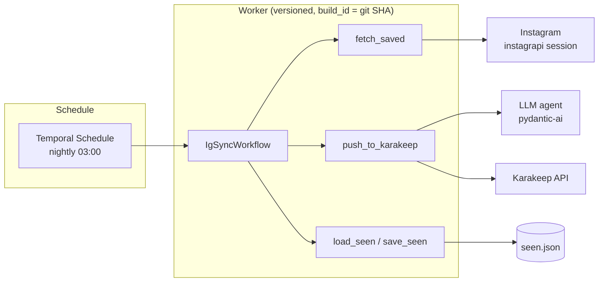

# Instagram → Karakeep, orchestrated with Temporal

[](https://github.com/abriemme/temporal-tests/actions/workflows/ci.yml)
[](.python-version)
[](https://docs.temporal.io/develop/python/worker-versioning)
[](https://ai.pydantic.dev)

A production-grade rewrite of a real automation: every night, the posts saved
on an Instagram account are turned into enriched bookmarks in
[Karakeep](https://karakeep.app/). It was previously a Python script driven by
n8n over HTTP; it is now a **Temporal application** — durable, replayable, and
testable — with **LLM-powered enrichment** (title, summary, tags) via
[pydantic-ai](https://ai.pydantic.dev).

## Why Temporal (what the n8n version had to hand-roll)

| Hand-rolled in the n8n script | Temporal primitive |
|---|---|
| HTTP endpoint + n8n cron trigger | Schedule (`python -m app.starter schedule`) |
| `cooldown.json` circuit-breaker on Instagram challenges | `workflow.sleep(cooldown)` timer, survives restarts |
| Threads + lock to prevent concurrent syncs | one workflow execution at a time, observable in the UI |
| Manual retry booleans | per-activity `RetryPolicy` + timeouts |
| `time.sleep` pacing, lost on crash | `workflow.sleep` timers (deterministic, replayable) |
| "did it work?" status endpoint | workflow result + history in the Temporal UI |

## Architecture



- **Workflow** (`app/sync/workflow.py`) — pure, deterministic orchestration:
  dedup against the seen-state, oldest-first ordering, pacing timer between
  pushes, circuit-breaker cooldown when Instagram raises a challenge.
- **Activities** (`app/sync/activities.py`) — thin Temporal wrappers; all I/O
  lives in a service layer (`instagram.py`, `karakeep.py`, `state.py`),
  unit-testable without any worker.
- **Enrichment** (`app/sync/enrich.py`) — a pydantic-ai agent turns each
  caption into a structured `Enrichment` (clean title, summary, up to 3 tags).
  Opt-in (`ENRICH_BOOKMARKS=1` + provider key), with a deterministic heuristic
  fallback so the sync never depends on an LLM being up.

## Engineering practices

- **Worker Deployment Versioning**: the worker registers with `build_id` = git
  SHA; each execution stays pinned to its version (`VersioningBehavior.PINNED`).
- **Tests (24)**: time-skipping workflow tests (`WorkflowEnvironment`), service
  unit tests, `ActivityEnvironment` tests, and a **replay test** that re-runs a
  committed JSON history to catch determinism-breaking changes before deploy.
- **LLM tests without network**: the agent is exercised with pydantic-ai's
  `TestModel` (structured output, no API key needed).
- **CI** ([ci.yml](.github/workflows/ci.yml)): ruff lint + format check, then
  tests + replay, then a Docker image tagged with the SHA, pushed to GHCR.
- **Unsandboxed workflow runner**: pydantic-ai depends on beartype, which
  monkey-patches the import machinery and is incompatible with the workflow
  sandbox; the workflow code stays deterministic, so this is safe (and
  documented [here](app/worker.py)).

## Layout

```
app/
  config.py            # env-based settings + build_id resolution (git SHA)
  sync/
    models.py          # SyncInput/SyncParams/SyncSummary, MediaItem, Enrichment (no I/O)
    workflow.py        # IgSyncWorkflow: dedup, ordering, pacing, cooldown timer
    activities.py      # thin @activity.defn wrappers
    instagram.py       # instagrapi session + saved-posts fetch (service)
    karakeep.py        # bookmark creation, payload, list membership (service)
    enrich.py          # pydantic-ai agent + heuristic fallback (service)
    state.py           # seen.json dedup state (service)
  starter.py           # manual sync run + nightly Schedule creation (replaces n8n)
  worker.py            # versioned worker (use_worker_versioning=True)
tests/
  conftest.py           # start_time_skipping() fixture
  test_enrich.py        # pydantic-ai agent tests (TestModel) + fallback
  test_activities.py    # service-layer unit tests + ActivityEnvironment mechanics
  test_sync_workflow.py # time-skipping workflow tests (mocked activities)
  test_replay.py        # replays tests/histories/*.json against current code
scripts/
  generate_history.py   # (re)generates the replay histories
```

## Quickstart

Requires [`uv`](https://docs.astral.sh/uv/) (Python 3.14 installed
automatically).

```bash
uv sync --group ig        # deps incl. instagrapi (worker machine)
uv run pytest             # 24 tests: unit + time-skipping + replay
```

Run against a local Temporal server:

```bash
temporal server start-dev
GIT_SHA=$(git rev-parse HEAD) uv run python -m app.worker     # worker
uv run python -m app.starter schedule                        # nightly schedule
uv run python -m app.starter sync --backfill                 # one-off sync
```

Environment:

| Variable | Purpose |
|---|---|
| `KARAKEEP_URL`, `KARAKEEP_TOKEN` | Karakeep instance + API token (required) |
| `KARAKEEP_LIST_ID` | optional list to add bookmarks to |
| `DATA_DIR` | `session.json` (instagrapi) and `seen.json` (dedup) |
| `MAX_ITEMS` | how many recent saved posts to examine per run |
| `ENRICH_BOOKMARKS`, `ENRICH_MODEL`, `OPENAI_API_KEY` | LLM enrichment (opt-in) |

Instagram login (once, interactive — produces `DATA_DIR/session.json`):
`instagrapi` session bootstrap; see `app/sync/instagram.py`.

## (Re)generate the replay histories

After a *deliberate*, replay-compatible workflow change:

```bash
uv run python scripts/generate_history.py
```

The replay test fails on any determinism-breaking divergence — before
anything reaches production.

## Docker

```bash
docker build --build-arg GIT_SHA=$(git rev-parse HEAD) -t ig-to-karakeep:$(git rev-parse HEAD) .
```

CI builds and pushes `ghcr.io/<repo>:<sha>` (default branch only).
